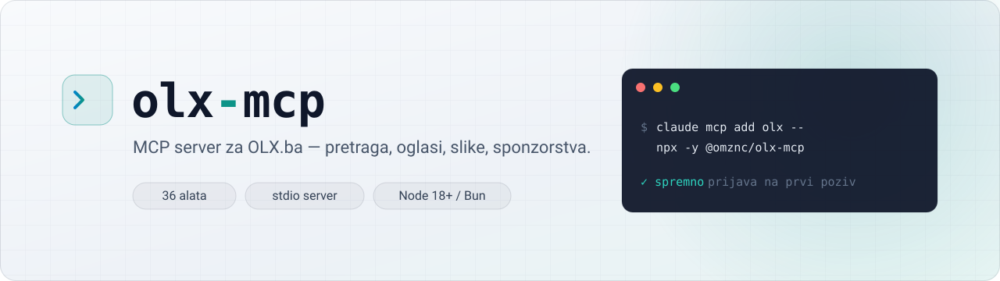
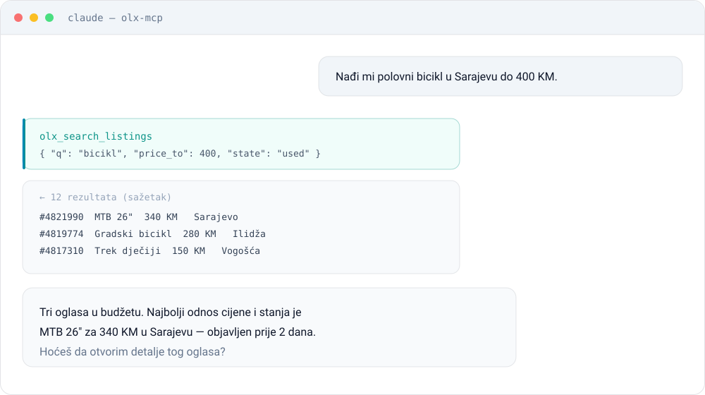
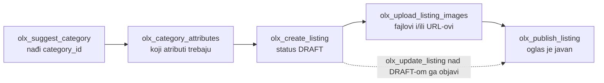

<p align="center">
  <picture>
    <source media="(prefers-color-scheme: dark)" srcset="assets/banner-dark.svg">
    <source media="(prefers-color-scheme: light)" srcset="assets/banner-light.svg">
    
  </picture>
</p>

<p align="center">
  <a href="https://www.npmjs.com/package/@omznc/olx-mcp"></a>
  <a href="https://www.npmjs.com/package/@omznc/olx-mcp"></a>
  <a href="https://github.com/omznc/olx-mcp/actions/workflows/ci.yml"></a>
  <a href="LICENSE"></a>
  
</p>

# olx-mcp (vibe coded nije me briga)

MCP server za [OLX.ba API](https://api-documentation.olx.ba/). Omogućava Claudeu (i drugim MCP
klijentima) da pretražuje OLX, objavljuje i uređuje oglase, upravlja slikama i sponzorstvima.
36 alata koji pokrivaju sve endpointe iz zvanične dokumentacije, plus pretragu oglasa.

## Kako izgleda

<p align="center">
  <picture>
    <source media="(prefers-color-scheme: dark)" srcset="assets/usage-dark.svg">
    <source media="(prefers-color-scheme: light)" srcset="assets/usage-light.svg">
    
  </picture>
</p>

Nekoliko primjera šta možete tražiti kad je server dodan:

| Vi kažete | Server odradi |
| --- | --- |
| „Nađi polovni bicikl u Sarajevu do 400 KM.” | `olx_search_listings` |
| „Koliko košta da sponzorišem oglas 4821990 na 7 dana?” | `olx_sponsor_price` |
| „Objavi oglas za Trek bicikl, 340 KM, ove tri slike.” | `olx_suggest_category` → `olx_create_listing` → `olx_upload_listing_images` → `olx_publish_listing` |
| „Koji moji oglasi su istekli?” | `olx_user_listings` |
| „Obnovi oglas 4819774 ako je besplatno.” | `olx_refresh_limits` → `olx_refresh_listing` |

## Instalacija

```sh
claude mcp add olx -- npx -y @omznc/olx-mcp
```

To je sve. Prvi put kad neki alat zatraži prijavu, server zatraži korisničko ime i lozinku kroz
sam MCP klijent (Claude Code prikaže prozorčić), razmijeni ih za token, sačuva ga i nastavi
prekinuti poziv. Nema posebne `login` komande ni restarta.

Ako vam više odgovara terminal, ili klijent ne podržava taj prozorčić:

```sh
npx -y @omznc/olx-mcp login
```

Treća opcija je bez ikakve prijave: podatke stavite u konfiguraciju samog servera.

```sh
claude mcp add olx -e OLX_USERNAME=vase.ime -e OLX_PASSWORD=vasa.lozinka -- npx -y @omznc/olx-mcp
```

Server se tada prijavi sam pri prvom pozivu i sam obnovi token kad istekne. Razlika je gdje stoji
lozinka: ovako ostaje zapisana u konfiguraciji MCP klijenta u čitljivom obliku, dok prozorčić i
`login` sačuvaju samo token. Sva tri načina rade, birajte po tome šta vam više odgovara.

Radi sa Node.js 18+ ili Bunom. `npx` je samo najčešće dostupan; ako koristite Bun, `bunx` radi
isto tako.

<details>
<summary>Drugi MCP klijenti (Cursor, Zed, Windsurf...)</summary>

Server je običan stdio MCP server, pa u konfiguraciju klijenta ide:

```json
{
  "mcpServers": {
    "olx": {
      "command": "npx",
      "args": ["-y", "@omznc/olx-mcp"]
    }
  }
}
```

Isto vrijedi i ovdje: klijenti koji podržavaju `elicitation` sami prikažu prozorčić za prijavu na
prvom alatu koji je traži. Ako ne podržavaju, prijavite se iz terminala
(`npx -y @omznc/olx-mcp login`) ili dodajte podatke u `env` iste konfiguracije:

```json
{
  "mcpServers": {
    "olx": {
      "command": "npx",
      "args": ["-y", "@omznc/olx-mcp"],
      "env": {
        "OLX_USERNAME": "vase.ime",
        "OLX_PASSWORD": "vasa.lozinka"
      }
    }
  }
}
```

</details>

## Ažuriranje

Paket je na npm-u, pa `npx -y @omznc/olx-mcp` sam povuče zadnju objavljenu verziju. Dovoljno je
restartovati MCP klijenta.

Ako `npx` drži staru verziju u cacheu, prisilite tačnu:

```sh
npx -y @omznc/olx-mcp@latest
```

Prijava ostaje sačuvana; token je u `auth.json`, ne u cacheu.

## Prijava

Prijava kroz MCP klijent (MCP „elicitation”) je podrazumijevani put i traži se tek kad zatreba,
na prvom alatu koji je ne može bez nje:

1. Alat poput `olx_me` naiđe na to da nema tokena ni env varijabli.
2. Server pošalje `elicitation/create`, klijent prikaže polja za korisničko ime i lozinku.
3. Podaci idu na `POST /auth/login`, token se sačuva u `auth.json`, prekinuti poziv se ponovi.

Lozinka pri tome ide MCP kanalom do ovog procesa, a ne kao argument alata, pa je model ne vidi u
transkriptu. Ali ne kontrolišemo šta klijent radi sa onim što ste ukucali u svoj prozorčić — ako
želite da lozinka ostane strogo lokalna, koristite `login` iz terminala.

Isto se dešava kad sačuvani token istekne: umjesto greške dobijete prozorčić i poziv se nastavi.

Klijent koji ne najavi `elicitation` sposobnost nikad ne dobije taj zahtjev i vidi običnu grešku
sa uputom da se pokrene `login`. `OLX_NO_ELICIT=1` isključuje prozorčić i kad ga klijent podržava.

### Iz terminala

```sh
npx -y @omznc/olx-mcp login     # traži korisničko ime i lozinku
npx -y @omznc/olx-mcp status    # provjeri da li prijava radi
npx -y @omznc/olx-mcp logout    # obriši sačuvani token
```

Lozinka se ne ispisuje dok se kuca i nigdje se ne čuva. Sačuva se samo token koji OLX vrati:

| Sistem | Lokacija |
| --- | --- |
| Linux / macOS | `$XDG_CONFIG_HOME/olx-mcp/auth.json`, inače `~/.config/olx-mcp/auth.json` |
| Windows | `%APPDATA%\olx-mcp\auth.json` |

Na Linuxu i macOS-u fajl dobija dozvole `600`, pa ga čita samo vaš korisnik.

Prijavljujte se kroz prozorčić, iz terminala ili preko varijabli okruženja ispod, a ne kroz
`olx_login` alat u razgovoru: argumenti alata se zapisuju u historiju razgovora, pa bi lozinka
završila tamo.

### Varijable okruženja

Idu u `env` konfiguracije MCP servera, ili u okruženje procesa kod CI-ja i sličnog. Imaju
prioritet nad sačuvanim tokenom:

| Varijabla | Opis |
| --- | --- |
| `OLX_TOKEN` | Gotov bearer token |
| `OLX_USERNAME` + `OLX_PASSWORD` | Server se sam prijavi pri prvom pozivu i obnovi token kad istekne |
| `OLX_CLIENT_ID` + `OLX_CLIENT_TOKEN` | Stari način autentikacije |
| `OLX_BASE_URL` | Promijeni API adresu (podrazumijevano `https://api.olx.ba`) |
| `OLX_MCP_CONFIG_DIR` | Promijeni gdje se čuva `auth.json` |
| `OLX_TIMEOUT_MS` | Timeout po zahtjevu prema OLX-u (podrazumijevano `30000`) |
| `OLX_NO_ELICIT` | Postavljena isključuje prijavu kroz prozorčić MCP klijenta |
| `OLX_ELICIT_TIMEOUT_MS` | Koliko se čeka na taj prozorčić (podrazumijevano `300000`, 5 minuta) |

## Alati

**Autentikacija**: `olx_login`, `olx_logout`, `olx_auth_status`

**Pretraga**: `olx_search_listings`

**Oglasi**: `olx_get_listing`, `olx_create_listing`, `olx_update_listing`,
`olx_publish_listing`, `olx_delete_listing`, `olx_finish_listing`, `olx_hide_listing`,
`olx_unhide_listing`, `olx_refresh_listing`, `olx_refresh_limits`, `olx_listing_limits`,
`olx_upload_listing_images`, `olx_delete_listing_image`, `olx_set_main_listing_image`

**Korisnici**: `olx_me`, `olx_user_listings` (aktivni / završeni / neaktivni / istekli / skriveni)

**Kategorije**: `olx_categories`, `olx_category`, `olx_category_attributes`,
`olx_category_brands`, `olx_category_brand_models`, `olx_suggest_category`, `olx_find_category`

**Lokacije**: `olx_cities`, `olx_city`, `olx_countries`, `olx_country_states`,
`olx_canton_cities`

**Sponzorstva**: `olx_sponsor_price`, `olx_sponsor_listing`, `olx_set_discount`,
`olx_finish_discount`

Samo `olx_search_listings` radi bez prijave; sve ostalo traži token.

## Objavljivanje oglasa



1. `olx_suggest_category`: nađite `category_id` na osnovu opisa artikla.
2. `olx_category_attributes`: pogledajte koje atribute ta kategorija traži.
3. `olx_create_listing`: vraća id novog oglasa, status `DRAFT`.
4. `olx_upload_listing_images`: lokalni fajlovi i/ili URL-ovi slika.
5. `olx_publish_listing`: oglas ide live.

**`DRAFT` nije privatan draft.** Provjereno na live API-ju: prvi `olx_update_listing` nad draftom
ga objavi. Status pređe u `active` i oglas je javno vidljiv, isto kao da je pozvan
`olx_publish_listing`. Zato oglas pravite tek kad je sadržaj gotov, a ne uz plan da se popravi
poslije.

## Pažnja: troši novac ili je nepovratno

- `olx_sponsor_listing` skida sredstva sa OLX računa. Prvo provjerite cijenu sa `olx_sponsor_price`.
- `olx_refresh_listing` je besplatan samo unutar limita iz `olx_refresh_limits`.
- `olx_delete_listing` se ne može poništiti; `olx_hide_listing` i `olx_finish_listing` mogu.
- `olx_publish_listing` čini oglas javno vidljivim na OLX-u.
- `olx_update_listing` nad `DRAFT` oglasom ga takođe objavi, vidi gore.

Svaki alat nosi MCP anotacije (`readOnlyHint`, `destructiveHint`, `idempotentHint`,
`openWorldHint`), pa MCP klijent može sam odlučiti šta pušta bez pitanja, a šta ne.
`olx_delete_listing`, `olx_delete_listing_image`, `olx_sponsor_listing` i `olx_logout` su
označeni kao destruktivni. Opisi alata uz to upozoravaju model da prvo pita korisnika, ali ni
jedno ni drugo nije tehnička zabrana.

## Napomene

- `GET /search` (iza `olx_search_listings`) **nije** dio zvanične dokumentacije. To je endpoint
  koji koristi sam OLX sajt, provjeren na live API-ju. Ne traži prijavu i može se promijeniti bez
  najave. Svi ostali alati odgovaraju dokumentovanim endpointima.
- Alati koji vraćaju velike odgovore (`olx_search_listings`, `olx_user_listings`,
  `olx_get_listing`, `olx_me`, `olx_cities`, `olx_categories`, `olx_category_attributes`) daju
  sažetak, da ne troše kontekst modela. Svaki od njih prima `full: true` za sirovi OLX odgovor.
- OLX vraća `403` ili `404` za endpointe za koje račun nema dozvolu, pa `404` ne znači uvijek da
  resurs ne postoji.
- Zahtjevi imaju timeout (`OLX_TIMEOUT_MS`, podrazumijevano 30s). `429` i mrežne greške se
  ponove sa kratkim backoffom; `5xx` se ponovi samo za `GET`, jer je upis možda već prošao.
- Ako OLX odbije token, a postavljeni su `OLX_USERNAME` + `OLX_PASSWORD`, server se sam ponovo
  prijavi i ponovi zahtjev. Sa samo `OLX_TOKEN` ili sačuvanim tokenom to nije moguće, pa treba
  ponovo `olx-mcp login`.
- Sve cijene su u KM (BAM).
- Ovo je nezvaničan projekat i nije povezan sa OLX-om.

## Razvoj

Za rad na projektu treba [Bun](https://bun.sh).

```sh
bun install
bun run start        # pokreni server iz src/
bun test             # pokreće server preko stdio i testira ga kao pravi MCP klijent
bun run typecheck
bun run build        # bundluje src/ u dist/index.js
```

`bun test` prvo bundluje `src/` u `dist/index.js`, jer dio testova pokreće baš taj bundle pod
Nodeom. `dist/` se ne commituje; objavljuje se na npm iz CI-ja kad se gurne `v*` tag.

Testovi koji zovu live OLX API su isključeni po defaultu, da pad na OLX-ovoj strani ne obara
nepovezan PR:

```sh
OLX_LIVE_TESTS=1 bun test
```

## Licenca

MIT
